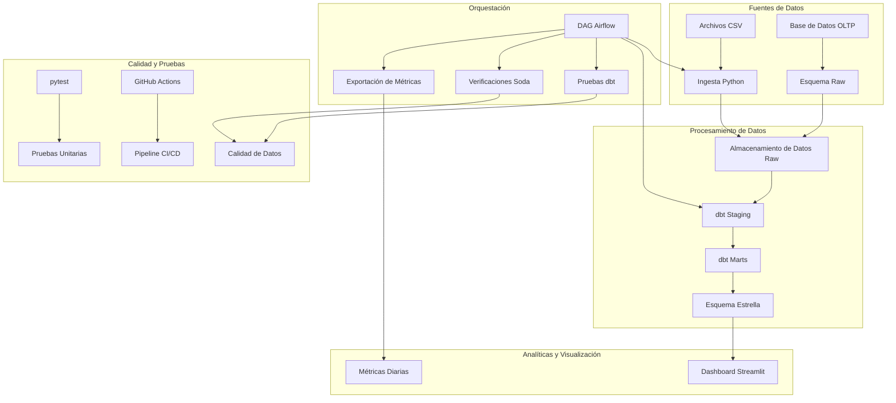

# Pipeline de Analíticas del Club

Una solución integral de analíticas construida sobre principios de stack de datos moderno, que incluye esquema estrella, transformaciones dbt, orquestación Airflow e ingesta de datos con Python. Este fue un proyecto entregado como resultado de un Trabajo Final Integrador (que eventualmente mejoré un poco) para la asignatura de Ingeniería de Datos I.

## 🏗️ Resumen de Arquitectura



## 📊 Modelo de Datos

### Diseño de Esquema Estrella

**Hechos:**
- `fact_ticket_sales` - Transacciones de venta de entradas
- `fact_dues_payments` - Pagos de cuotas de membresía
- `fact_attendance` - Registros de asistencia a eventos

**Dimensiones:**
- `dim_member` - Información de miembros con claves suplentes
- `dim_event` - Eventos, partidos y actividades
- `dim_date` - Dimensión de fecha comprensiva (2020-2030)

### Métricas Clave

- **MRR (Ingresos Recurrentes Mensuales)** - De pagos de cuotas
- **ARPPM (Ingresos Promedio por Miembro Pagador)** - Eficiencia de ingresos
- **Ingresos por Eventos** - Rendimiento de venta de entradas
- **Tasa de Retención** - Métricas de compromiso de miembros

## 🚀 Inicio Rápido

### Prerrequisitos

- Docker & Docker Compose
- Python 3.9+
- PostgreSQL 15+

### Configuración en 5 Comandos

```bash
# 1. Clonar y navegar
git clone <repository-url>
cd club-analytics

# 2. Iniciar servicios
docker-compose up -d

# 3. Esperar a que los servicios se inicialicen
sleep 30

# 4. Ejecutar pipeline de datos
docker-compose exec airflow-webserver python /opt/airflow/scripts/data_ingestion.py

# 5. Ver dashboard
streamlit run streamlit_app.py
```

## 📁 Estructura del Proyecto

```
club-analytics/
├── airflow/
│   └── dags/
│       └── club_analytics_pipeline.py
├── dbt/
│   ├── models/
│   │   ├── staging/
│   │   └── marts/
│   ├── dbt_project.yml
│   └── packages.yml
├── sql/
│   ├── init/
│   ├── star_schema.sql
│   └── populate_star_schema.sql
├── scripts/
│   └── data_ingestion.py
├── soda/
│   └── configuration.yml
├── tests/
│   └── test_data_ingestion.py
├── docker-compose.yml
├── requirements.txt
└── streamlit_app.py
```

## 🔄 Flujo del Pipeline de Datos

### 1. Ingesta de Datos
- **Script Python**: Simula generación diaria de CSV
- **Fuentes**: Datos de entradas, cuotas, asistencia
- **Formato**: Archivos CSV en `/data/raw/`

### 2. Transformación de Datos (dbt)
- **Staging**: Limpieza y estandarización de datos raw
- **Marts**: Lógica de negocio y población del esquema estrella
- **Pruebas**: Validación de calidad de datos

### 3. Orquestación (Airflow)
- **DAG**: Ejecución diaria del pipeline
- **Tareas**: Ingesta → dbt → Calidad → Métricas
- **Monitoreo**: Interfaz web en `http://localhost:8080`

### 4. Calidad de Datos
- **Pruebas dbt**: Únicos, no nulos, integridad referencial
- **Verificaciones Soda**: Reglas de negocio y validación de datos
- **Monitoreo**: Puertas de calidad automatizadas

## 🧪 Estrategia de Pruebas

### Pruebas Unitarias (pytest)
```bash
pytest tests/ -v
```

### Pruebas dbt
```bash
cd dbt
dbt test
```

### Calidad de Datos Soda
```bash
soda scan -d postgres_local -c soda/configuration.yml
```

### Pipeline CI/CD
- **GitHub Actions**: Pruebas automatizadas en push/PR
- **Docker Build**: Validación de servicios
- **Escaneo de Seguridad**: Verificaciones de vulnerabilidades

## 📈 Características Clave

### Capacidades de Analíticas
- **Esquema Estrella**: Optimizado para consultas analíticas
- **Claves Suplentes**: Referencias consistentes de dimensiones
- **Dimensión de Fecha**: Análisis temporal comprensivo
- **Métricas de Negocio**: MRR, ARPPM, retención

### Calidad de Datos
- **Integridad Referencial**: Validación de claves foráneas
- **Reglas de Negocio**: Lógica de validación personalizada
- **Frescura de Datos**: Monitoreo automatizado
- **Detección de Anomalías**: Validación estadística

### Visualización
- **Dashboard Streamlit**: Analíticas interactivas
- **Métricas en Tiempo Real**: Actualizaciones de datos en vivo
- **Filtrado**: Rangos de fechas, tipos de eventos, estado de miembros
- **Exportación**: Exportación de datos CSV/JSON

## 🔧 Configuración

### Variables de Entorno
```bash
POSTGRES_HOST=localhost
POSTGRES_PORT=5432
POSTGRES_USER=postgres
POSTGRES_PASSWORD=postgres
POSTGRES_DATABASE=club_analytics
```

### Configuración dbt
```yaml
# profiles.yml
club_analytics:
  target: dev
  outputs:
    dev:
      type: postgres
      host: localhost
      user: postgres
      password: postgres
      port: 5432
      dbname: club_analytics
      schema: analytics
```

### Configuración Airflow
- **Ejecutor**: LocalExecutor
- **Base de Datos**: PostgreSQL
- **DAGs**: `/opt/airflow/dags`
- **Logs**: `/opt/airflow/logs`

## 📊 Consultas de Ejemplo

### Análisis de Ingresos
```sql
-- Tendencia MRR mensual
SELECT 
    dd.year,
    dd.month_name,
    SUM(fdp.payment_amount) as mrr
FROM analytics.fact_dues_payments fdp
JOIN analytics.dim_date dd ON fdp.date_key = dd.date_key
WHERE fdp.is_paid = true
GROUP BY dd.year, dd.month_name
ORDER BY dd.year, dd.month;
```

### Compromiso de Miembros
```sql
-- Top eventos por asistencia
SELECT 
    de.event_name,
    de.event_type,
    COUNT(fa.attendance_key) as attendance_count
FROM analytics.fact_attendance fa
JOIN analytics.dim_event de ON fa.event_key = de.event_key
GROUP BY de.event_name, de.event_type
ORDER BY attendance_count DESC;
```

### Análisis de Retención
```sql
-- Retención de miembros por mes de registro
SELECT 
    dm.registration_year,
    dm.registration_month,
    COUNT(*) as total_members,
    COUNT(CASE WHEN dm.status_active THEN 1 END) as active_members,
    ROUND(COUNT(CASE WHEN dm.status_active THEN 1 END)::float / COUNT(*) * 100, 2) as retention_rate
FROM analytics.dim_member dm
GROUP BY dm.registration_year, dm.registration_month
ORDER BY dm.registration_year, dm.registration_month;
```

## 🚀 Despliegue en la Nube (Opcional)

### Configuración AWS Free Tier
```bash
# S3 para almacenamiento de datos raw
aws s3 mb s3://club-analytics-raw

# Redshift Serverless para data warehouse
aws redshift-serverless create-workgroup --workgroup-name club-analytics

# Glue para procesamiento ETL
aws glue create-job --name club-analytics-etl
```

### Databricks Community
```bash
# Delta Lake para almacenamiento de datos
spark.sql("CREATE DATABASE IF NOT EXISTS club_analytics")

# Tablas Delta para hechos y dimensiones
spark.sql("CREATE TABLE fact_ticket_sales USING DELTA")
```

## 📚 Documentación

### Linaje de Datos
- **Documentos dbt**: `dbt docs generate && dbt docs serve`
- **Gráfico de Linaje**: Representación visual del flujo de datos
- **Dependencias de Modelos**: Cadena de transformación clara

### Documentación de API
- **Streamlit**: Documentación de dashboard interactivo
- **Airflow**: Documentación de DAG y tareas
- **dbt**: Documentación de modelos y pruebas

## 🤝 Contribuir ;D

1. Fork del repositorio
2. Crear una rama de feature
3. Hacer cambios con pruebas
4. Ejecutar pipeline CI/CD
5. Enviar un pull request

## 📄 Licencia

Este proyecto está licenciado bajo la Licencia MIT - ver el archivo LICENSE para detalles.

## 🆘 Soporte

- **Issues**: GitHub Issues para reportes de bugs
- **Discussions**: GitHub Discussions para preguntas
- **Documentación**: README y comentarios en línea de código

---

**Construido con ❤️ por Ivo Danko, usando principios de stack de datos moderno**


